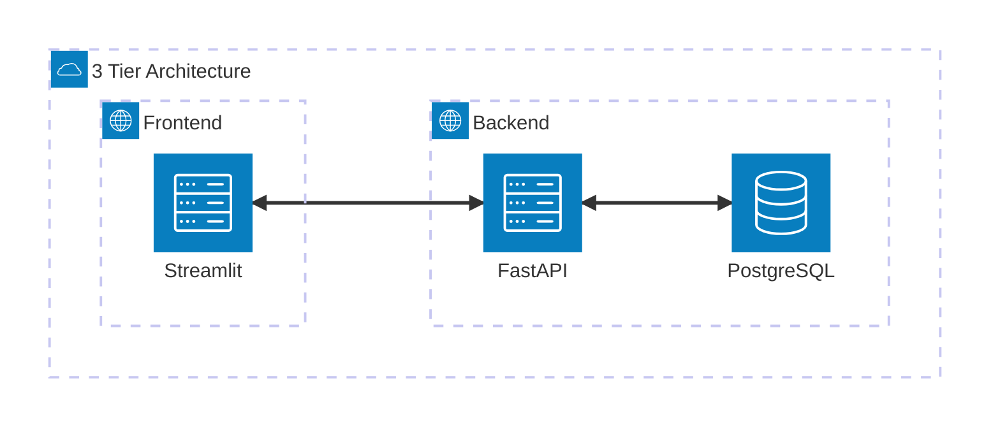
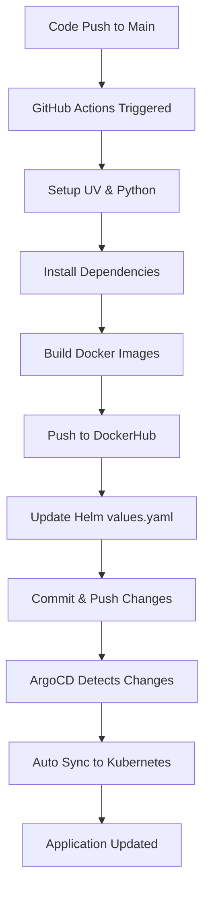

# N-Tier Application with Automated CI/CD Pipeline

A complete 3-tier web application with FastAPI backend, Streamlit frontend, and PostgreSQL database, featuring automated CI/CD pipeline using Docker, Kubernetes, Helm, GitHub Actions, and ArgoCD.

## 🏗️ Architecture



## 📁 Project Structure

```
.
├── .github/workflows/main.yaml     # CI/CD Pipeline
├── app/                           # FastAPI Application
├── client/                        # Streamlit Application
├── helm/                          # Helm Charts
├── kubernetes/                    # K8s Manifests
├── docker-compose.yml             # Local Development
├── Dockerfile.server              # API Docker Image
├── Dockerfile.client              # UI Docker Image
├── argocd-application.yaml        # ArgoCD Application
└── pyproject.toml                 # Python Dependencies
```

## 🚀 Manual Deployment Guide

### 1. Python Environment Setup with UV

- **Install UV** (if not already installed):
   ```bash
    # macOS using Homebrew (recommended)
    brew install uv
    
    # macOS/Linux using installer
    curl -LsSf https://astral.sh/uv/install.sh | sh
    
    # Windows
    powershell -c "irm https://astral.sh/uv/install.ps1 | iex"
    
    # Using pip
    pip install uv
    ```
- Setting up UV (Python's Package Manager):
    ```bash
    # Initialize UV project
    uv init --name n-tier --app

    # Create virtual environment
    uv venv --python 3.13

    # Activate environment (Linux/macOS)
    source .venv/bin/activate

    # Install dependencies
    uv sync
    ```
- Run The Application locally:
    - Run API(FastAPI)
        ```bash
        uv run uvicorn app.main:app --reload --host 0.0.0.0 --port 8000
        ```
    - Run Streamlit application 
        ```bash
        uv run streamlit run main.py
        ```

### 2. Docker Operations

#### Build Docker Images

```bash
# Build FastAPI server image
docker build -f Dockerfile.server -t <dockerhub-user-name>/fastapi-server:latest .

# Build Streamlit client image  
docker build -f Dockerfile.client -t <dockerhub-user-name>/streamlit-client:latest .
```

#### Push to DockerHub

```bash
# Login to DockerHub
docker login

# Push images
docker push <dockerhub-user-name>/fastapi-server:latest
docker push <dockerhub-user-name>/streamlit-client:latest
```

#### Test with Docker Compose

```bash
# Start application stack
docker compose up -d

# View logs
docker compose logs -f

# Stop and cleanup
docker compose down
```

**Access Points:**
- **Frontend:** http://localhost:8501
- **API:** http://localhost:8000
- **PgAdmin:** http://localhost:5050

### 3. Kubernetes Deployment (OrbStack)

#### Deploy with Kubectl

```bash
# Create namespace
kubectl apply -f kubernetes/namespace.yaml

# Deploy all services
kubectl apply -f kubernetes/

# Check deployment status
kubectl get pods -n fastapi-app
kubectl get services -n fastapi-app

# Port forward for local access
kubectl port-forward -n fastapi-app svc/client-service 8501:8501
kubectl port-forward -n fastapi-app svc/api-service 8000:8000
```

#### Cleanup

```bash
# Delete all resources
kubectl delete -f kubernetes/

# Delete namespace
kubectl delete namespace fastapi-app
```

### 4. Helm Deployment

#### Deploy with Helm

```bash
# Install application
helm install n-tier-app ./helm

# Upgrade deployment
helm upgrade n-tier-app ./helm

# Check status
helm status n-tier-app
kubectl get pods -n fastapi-app
```

#### Cleanup

```bash
# Uninstall Helm release
helm uninstall n-tier-app

# Delete namespace if needed
kubectl delete namespace fastapi-app
```

### 5. ArgoCD Setup

#### Install ArgoCD

```bash
# Create ArgoCD namespace
kubectl create namespace argocd

# Install ArgoCD
kubectl apply -n argocd -f https://raw.githubusercontent.com/argoproj/argo-cd/stable/manifests/install.yaml

# Wait for pods to be ready
kubectl wait --for=condition=available --timeout=300s deployment/argocd-server -n argocd
```

#### Access ArgoCD

```bash
# Port forward ArgoCD server
kubectl port-forward svc/argocd-server -n argocd 8080:443

# Get admin password
kubectl -n argocd get secret argocd-initial-admin-secret -o jsonpath="{.data.password}" | base64 -d
```

**ArgoCD Access:** https://localhost:8080
- **Username:** admin
- **Password:** (from command above)

#### Deploy Application via ArgoCD

```bash
# Apply ArgoCD application
kubectl apply -f argocd-application.yaml

# Sync application
argocd app sync test-three-tier-app
```

#### Cleanup ArgoCD

```bash
# Delete application
kubectl delete -f argocd-application.yaml

# Uninstall ArgoCD
kubectl delete -n argocd -f https://raw.githubusercontent.com/argoproj/argo-cd/stable/manifests/install.yaml
kubectl delete namespace argocd
```

## 🔄 Automated CI/CD Pipeline

### CI/CD Flow Diagram



### Pipeline Features

- **Continuous Integration:**
  - Automated Docker image builds
  - Automatic tagging with commit SHA
  - Automatic Helm values update
  - DockerHub registry push

- **Continuous Deployment:**
  - GitOps approach with ArgoCD
  - Auto Sync with Updated Helm values
  - Self-healing deployments
  - Rollback capabilities

### Pipeline Triggers

- Triggers on push to `main` branch
- Builds both FastAPI and Streamlit images
- Updates Helm chart with new image tags
- ArgoCD automatically syncs changes to cluster

### Required Secrets

Configure these secrets in GitHub repository settings:

```
DOCKERHUB_USRNAME=your_dockerhub_username
DOCKERHUB_PSWD=your_dockerhub_password
```

## 🛠️ Technology Stack

- **Frontend:** Streamlit
- **Backend:** FastAPI
- **Database:** PostgreSQL
- **Containerization:** Docker
- **Orchestration:** Kubernetes
- **Package Management:** Helm
- **CI/CD:** GitHub Actions
- **GitOps:** ArgoCD
- **Local K8s:** OrbStack

## 📝 Development Workflow

1. **Local Development:** Use UV for dependency management
2. **Testing:** Docker Compose for integration testing
3. **Deployment:** Kubernetes with Helm charts
4. **Production:** Automated CI/CD with ArgoCD

## 🔍 Monitoring & Debugging

```bash
# Check application logs
kubectl logs -f deployment/api-deployment -n fastapi-app
kubectl logs -f deployment/client-deployment -n fastapi-app

# Check ArgoCD application status
kubectl get applications -n argocd
argocd app get test-three-tier-app

# Monitor resource usage
kubectl top pods -n fastapi-app
```
---

**Note:** Ensure OrbStack or another local Kubernetes solution is running before executing Kubernetes commands.